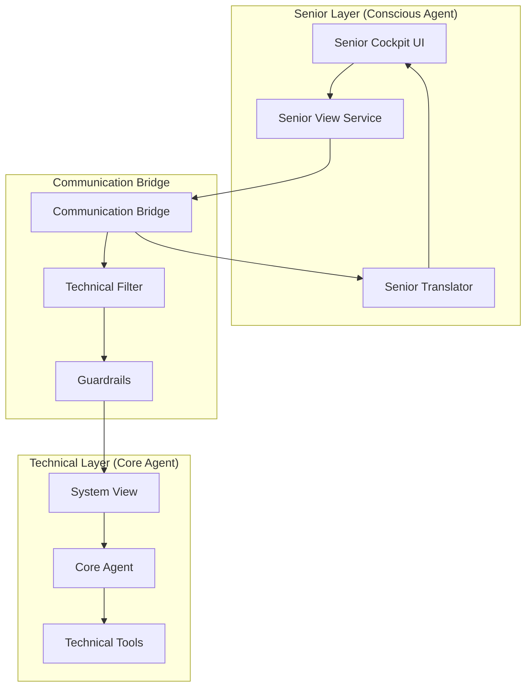

# Design Document - Senior Cockpit (Fas 0.4)

**Datum:** 2025-08-13  
**Status:** 2🟡 SKAPAS - Arkitektur och komponentdesign  
**Syfte:** Definiera teknisk arkitektur för det centrala senior-vänliga gränssnittet  
**Relaterat:** Communication Bridge, Conscious Agent, Dual Consciousness Architecture

## Overview

Senior Cockpit är det centrala intelligent filter-gränssnittet som realiserar Dual Consciousness Architecture genom att dölja all teknisk komplexitet bakom ett senior-vänligt gränssnitt. Det ersätter 40+ tekniska dokument med ett enda dynamiskt gränssnitt som automatiskt filtrerar och översätter all information för seniorer.

## Architecture

### High-Level Architecture



### Component Separation

**Senior Layer (Conscious Agent)**
- Endast senior-vänlig information
- Visuella komponenter och UI
- Naturligt språk och metaforer
- Automatiska sammanfattningar

**Communication Bridge**
- Säker informationsfiltrering
- Teknisk jargong-blockering
- Kontextmedveten översättning
- Audit logging

**Technical Layer (Core Agent)**
- All teknisk komplexitet
- Systemdata och metrics
- Verktygsintegration
- Felhantering

## Components and Interfaces

### 1. Senior Cockpit UI Components

#### Main Dashboard Component
```typescript
interface SeniorDashboard {
  projectOverview: ProjectSummary;
  phaseProgress: PhaseIndicator;
  recentUpdates: SeniorFriendlyUpdate[];
  notifications: SeniorNotification[];
}

interface ProjectSummary {
  title: string;
  description: string; // Senior-friendly, no technical terms
  currentPhase: 'Crawl' | 'Walk' | 'Run' | 'Fly';
  overallProgress: number; // 0-100
  nextMilestone: string;
}
```

#### Phase Progress Component
```typescript
interface PhaseIndicator {
  phases: PhaseStatus[];
  currentPhase: string;
  visualStyle: 'progress-bar' | 'milestone-dots' | 'journey-map';
}

interface PhaseStatus {
  name: string;
  displayName: string; // "Grundläggande Setup" instead of "CRAWL"
  status: 'completed' | 'active' | 'upcoming';
  progress: number;
  description: string; // Senior-friendly explanation
}
```

#### Notification System
```typescript
interface SeniorNotification {
  id: string;
  type: 'success' | 'info' | 'working' | 'celebration';
  title: string; // "Bra jobbat!" instead of "Build successful"
  message: string; // Senior-friendly language
  timestamp: Date;
  priority: 'high' | 'medium' | 'low';
  autoHide: boolean;
}
```

### 2. Senior View Service

#### Data Transformation Layer
```typescript
class SeniorViewService {
  async getProjectOverview(): Promise<ProjectSummary> {
    const systemView = await this.communicationBridge.getSystemView();
    return this.seniorTranslator.transformToSeniorView(systemView);
  }
  
  async getPhaseProgress(): Promise<PhaseIndicator> {
    const technicalProgress = await this.communicationBridge.getTechnicalProgress();
    return this.seniorTranslator.translatePhaseProgress(technicalProgress);
  }
  
  async getRecentUpdates(): Promise<SeniorFriendlyUpdate[]> {
    const systemEvents = await this.communicationBridge.getSystemEvents();
    return this.seniorTranslator.aggregateToSeniorUpdates(systemEvents);
  }
}
```

#### Senior Translator (Enhanced)
```typescript
class SeniorTranslator {
  // Context-aware translation instead of simple word replacement
  translatePhaseProgress(technicalData: TechnicalProgress): PhaseIndicator {
    return {
      phases: technicalData.phases.map(phase => ({
        name: phase.id,
        displayName: this.getPhaseDisplayName(phase.id),
        status: this.translateStatus(phase.status),
        progress: phase.completion,
        description: this.generatePhaseDescription(phase)
      })),
      currentPhase: this.getPhaseDisplayName(technicalData.currentPhase),
      visualStyle: 'journey-map' // Most senior-friendly
    };
  }
  
  // Contextual aggregation of technical events
  aggregateToSeniorUpdates(events: SystemEvent[]): SeniorFriendlyUpdate[] {
    const grouped = this.groupEventsByContext(events);
    return grouped.map(group => this.createSeniorUpdate(group));
  }
  
  private createSeniorUpdate(eventGroup: SystemEvent[]): SeniorFriendlyUpdate {
    // Transform multiple technical events into one meaningful senior message
    const context = this.analyzeEventContext(eventGroup);
    return {
      title: this.generatePositiveTitle(context),
      description: this.generateEncouragingDescription(context),
      timestamp: eventGroup[0].timestamp,
      type: 'progress'
    };
  }
}
```

### 3. Communication Bridge Integration

#### Secure Data Flow
```typescript
interface CommunicationBridge {
  // All data flows through guardrails
  async getSystemView(): Promise<SystemView>;
  async getSeniorSafeData(): Promise<SeniorSafeData>;
  async reportSeniorInteraction(interaction: SeniorInteraction): Promise<void>;
}

interface TechnicalFilter {
  // Blocks technical jargon automatically
  filterTechnicalContent(content: any): SeniorSafeContent;
  validateSeniorSafety(data: any): boolean;
  logFilteredContent(blocked: any[]): void;
}
```

### 4. UI Component Architecture

#### Responsive Design System
```typescript
// Large, senior-friendly components
const SeniorDesignTokens = {
  fontSize: {
    small: '18px',    // Minimum readable size
    medium: '24px',   // Standard text
    large: '32px',    // Headers
    xlarge: '48px'    // Main titles
  },
  spacing: {
    touch: '44px',    // Minimum touch target
    comfortable: '24px',
    generous: '48px'
  },
  colors: {
    primary: '#2563eb',      // High contrast blue
    success: '#16a34a',      // Clear green
    warning: '#ea580c',      // Visible orange
    background: '#ffffff',   // Pure white
    text: '#1f2937'         // Dark gray for readability
  }
};
```

#### Accessibility Features
```typescript
interface AccessibilityFeatures {
  screenReaderSupport: boolean;
  keyboardNavigation: boolean;
  highContrastMode: boolean;
  textScaling: boolean;
  reducedMotion: boolean;
  voiceNavigation?: boolean; // Future enhancement
}
```

## Data Models

### Senior-Safe Data Structures

```typescript
// All data models are designed to be senior-safe by default
interface SeniorSafeData {
  // No technical fields exposed
  projectName: string;
  friendlyDescription: string;
  currentActivity: string;
  progressPercentage: number;
  nextSteps: string[];
  celebrationMoments: string[];
}

interface SeniorFriendlyUpdate {
  title: string;           // "Vi har gjort framsteg!"
  description: string;     // "Idag slutförde vi grundläggande setup"
  type: 'progress' | 'celebration' | 'milestone' | 'info';
  timestamp: Date;
  relatedPhase?: string;
}

// Technical data is completely separate and never exposed
interface SystemView {
  // This data never reaches Senior Cockpit directly
  technicalMetrics: any;
  errorLogs: any;
  buildStatus: any;
  // ... all technical complexity hidden
}
```

## Error Handling

### Senior-Friendly Error Management

```typescript
class SeniorErrorHandler {
  handleError(error: Error): SeniorNotification {
    // Never show technical errors to seniors
    const seniorMessage = this.translateErrorToSeniorMessage(error);
    
    // Log technical details separately for developers
    this.logTechnicalError(error);
    
    // Always provide reassuring message
    return {
      type: 'working',
      title: 'Vi arbetar på det',
      message: seniorMessage,
      autoHide: false // Let senior dismiss when ready
    };
  }
  
  private translateErrorToSeniorMessage(error: Error): string {
    // Map technical errors to senior-friendly messages
    const errorMappings = {
      'NetworkError': 'Vi har tillfälliga problem med anslutningen. Försök igen om en stund.',
      'ValidationError': 'Något blev inte riktigt rätt. Vi fixar det åt dig.',
      'TimeoutError': 'Det tar lite längre tid än vanligt. Vi fortsätter arbeta i bakgrunden.',
      'default': 'Vi stötte på ett litet problem, men vi löser det snart.'
    };
    
    return errorMappings[error.constructor.name] || errorMappings.default;
  }
}
```

### Graceful Degradation

```typescript
class GracefulDegradation {
  // Always provide something useful, even if systems are down
  async getProjectOverview(): Promise<ProjectSummary> {
    try {
      return await this.seniorViewService.getProjectOverview();
    } catch (error) {
      // Fallback to cached data or default message
      return this.getFallbackProjectOverview();
    }
  }
  
  private getFallbackProjectOverview(): ProjectSummary {
    return {
      title: 'Ditt Projekt',
      description: 'Vi arbetar på att bygga något fantastiskt åt dig.',
      currentPhase: 'Crawl',
      overallProgress: 0,
      nextMilestone: 'Vi förbereder nästa steg'
    };
  }
}
```

## Testing Strategy

### Senior User Testing

```typescript
interface SeniorTestingPlan {
  // Test with real seniors, not developers
  testGroups: {
    age65to75: SeniorTestGroup;
    age75to85: SeniorTestGroup;
    techComfortable: SeniorTestGroup;
    techNovice: SeniorTestGroup;
  };
  
  testScenarios: [
    'First time opening the application',
    'Understanding project progress',
    'Responding to notifications',
    'Finding help when confused',
    'Recovering from errors'
  ];
  
  successCriteria: {
    intuitive: 'Senior understands without explanation';
    comfortable: 'Senior feels confident using it';
    helpful: 'Senior gets value from the information';
    safe: 'Senior never sees technical complexity';
  };
}
```

### Automated Testing

```typescript
// Test that technical complexity never leaks through
describe('Senior Safety Tests', () => {
  test('No technical jargon in UI', async () => {
    const ui = await renderSeniorCockpit();
    const technicalTerms = ['API', 'JSON', 'HTTP', 'Git', 'Build', 'Deploy'];
    
    technicalTerms.forEach(term => {
      expect(ui.text).not.toContain(term);
    });
  });
  
  test('All error messages are senior-friendly', async () => {
    const errors = await simulateAllPossibleErrors();
    
    errors.forEach(error => {
      const seniorMessage = seniorErrorHandler.handleError(error);
      expect(seniorMessage.message).toMatch(/^[A-ZÅÄÖ]/); // Starts with capital
      expect(seniorMessage.message).not.toMatch(/error|fail|crash/i);
      expect(seniorMessage.message).toContain('vi'); // Inclusive language
    });
  });
});
```

## Implementation Phases

### Phase 1: Core UI Components
- Basic dashboard layout
- Project overview display
- Phase progress indicator
- Simple notification system

### Phase 2: Data Integration
- Senior View Service implementation
- Communication Bridge integration
- Basic error handling
- Fallback mechanisms

### Phase 3: Enhanced Translation
- Context-aware Senior Translator
- Automatic progress aggregation
- Intelligent notification grouping
- Advanced error translation

### Phase 4: Senior Testing & Refinement
- Real senior user testing
- UI/UX improvements based on feedback
- Accessibility enhancements
- Performance optimization

## Security Considerations

### Information Separation
- Strict separation between senior and technical data
- Automatic filtering of all technical content
- Audit logging of all data transformations
- No direct access to technical systems

### Senior Privacy
- Minimal data collection
- Transparent data usage
- Easy data export/deletion
- GDPR compliance by design

This design provides a comprehensive foundation for implementing the Senior Cockpit that truly hides technical complexity while providing meaningful, encouraging information to senior users.