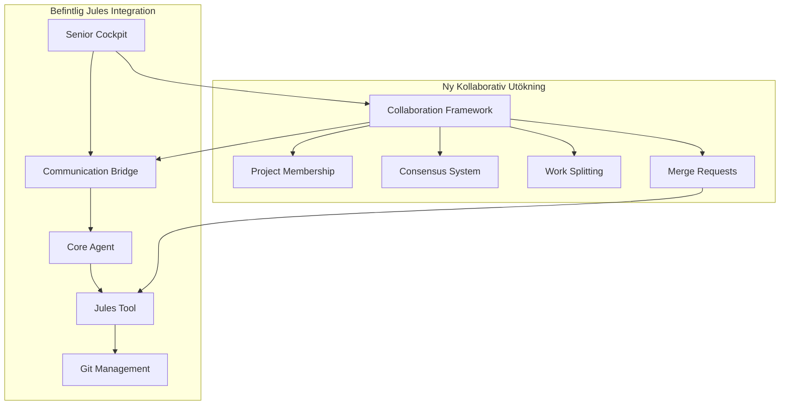
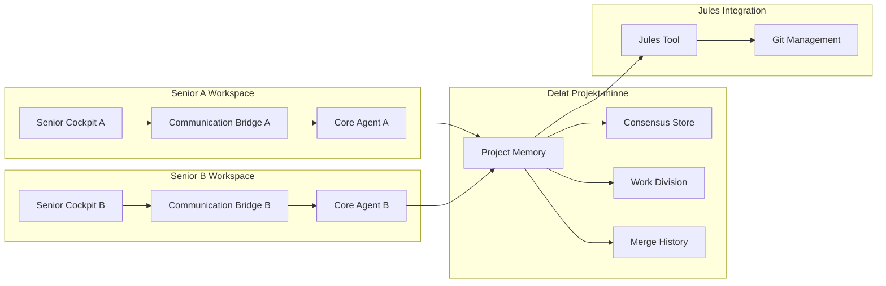

# Design Document - Kollaborativ Senior-utveckling

**Datum:** 2025-08-13  
**Status:** 1🟢 GODKÄND - Redo för implementation i Fas 2  
**Syfte:** Designa elegant kollaborationssystem som återanvänder Jules-arkitektur  
**Relaterat:** fas-0-jules-tool-integration, fas-0-senior-cockpit  
**Implementation:** Godkänd för Fas 2 implementation enligt Master Plan

## Overview

"Vän-som-Jules" modellen revolutionerar senior-kollaboration genom att behandla medarbetare som intelligenta assistenter istället för komplexa realtidsanvändare. Detta eliminerar teknisk komplexitet samtidigt som det möjliggör genuint meningsfullt samarbete mellan seniorer.

### Kärnprinciper
1. **Återanvänd Jules-arkitektur**: Samma tillförlitlighet och enkelhet
2. **Konsensus över konflikt**: Beslut fattas innan implementation
3. **Asynkron arbetsstil**: Ingen stress med realtid
4. **Naturlig uppdelning**: "Du gör X, jag gör Y" approach

## Architecture

### Befintlig Arkitektur som Grund



### Kollaborativ Arkitektur-utökning



## Components and Interfaces

### 1. Collaboration Framework

**Syfte**: Koordinera flera seniorer utan teknisk komplexitet

```typescript
interface CollaborationFramework {
  // Projekt-medlemskap
  inviteCollaborator(projectId: string, friendEmail: string): Promise<Invitation>
  acceptInvitation(invitationId: string): Promise<ProjectMembership>
  
  // Konsensus-hantering
  proposeDecision(decision: SeniorDecision): Promise<ConsensusRequest>
  respondToConsensus(requestId: string, response: 'agree' | 'disagree' | 'suggest'): Promise<void>
  
  // Arbetsuppdelning
  suggestWorkDivision(projectGoal: string): Promise<WorkDivision>
  claimWorkItem(itemId: string, seniorId: string): Promise<WorkClaim>
  
  // Merge-hantering (återanvänder Jules)
  requestMerge(workItems: WorkItem[]): Promise<MergeRequest>
  reviewMergeResult(mergeId: string): Promise<MergeReview>
}
```

### 2. Senior-vänliga Gränssnitt

**Konsensus-komponenter**:
```typescript
interface ConsensusUI {
  // Enkla beslutsgränssnitt
  showDecisionRequest(decision: string, options: SimpleOption[]): void
  showAgreementStatus(participants: Participant[], status: ConsensusStatus): void
  
  // Vänlig kommunikation
  showFriendActivity(friend: string, activity: string): void
  showCollaborationInvite(from: string, projectName: string): void
}

interface SimpleOption {
  text: string           // "Ja, det låter bra"
  emoji: string         // "👍"
  action: ConsensusAction
}
```

**Arbetsuppdelnings-UI**:
```typescript
interface WorkDivisionUI {
  showWorkSuggestion(suggestion: {
    myPart: string      // "Du kan göra familjekalender-delen"
    friendPart: string  // "Din vän kan göra påminnelse-delen"  
    sharedPart: string  // "Ni bestämmer tillsammans hur det ska se ut"
  }): void
  
  showWorkProgress(myProgress: number, friendProgress: number): void
  showReadyToMerge(bothReady: boolean): void
}
```

### 3. Utökad Project Memory

**Kollaborativ minneshantering**:
```typescript
interface CollaborativeMemory extends ProjectMemory {
  // Medlemskap och roller
  members: ProjectMember[]
  ownership: WorkOwnership
  
  // Konsensus-historik
  decisions: ConsensusDecision[]
  agreements: Agreement[]
  
  // Arbetsuppdelning
  workDivision: WorkDivision
  individualProgress: Map<string, WorkProgress>
  
  // Merge-historik (återanvänder Jules)
  mergeHistory: MergeRecord[]
}

interface ProjectMember {
  seniorId: string
  name: string           // "Astrid"
  role: 'initiator' | 'collaborator'
  joinedAt: Date
  lastActive: Date
}
```

### 4. Consensus System

**Beslutsfattning utan teknisk komplexitet**:
```typescript
interface ConsensusSystem {
  // Skapa beslut
  createDecision(
    question: string,     // "Ska vi lägga till en påminnelse-funktion?"
    context: string,      // "För att hjälpa användare komma ihåg mediciner"
    options: string[]     // ["Ja, det är bra", "Nej, för komplicerat", "Kanske senare"]
  ): Promise<ConsensusRequest>
  
  // Hantera svar
  recordResponse(requestId: string, response: ConsensusResponse): Promise<void>
  checkConsensus(requestId: string): Promise<ConsensusResult>
  
  // Konfliktlösning
  suggestCompromise(disagreement: Disagreement): Promise<Compromise>
  escalateToDiscussion(issue: string): Promise<DiscussionThread>
}
```

### 5. Work Splitting Engine

**Intelligent arbetsuppdelning**:
```typescript
interface WorkSplittingEngine {
  // Analysera projekt för uppdelning
  analyzeProject(projectGoal: string, requirements: string[]): Promise<WorkAnalysis>
  
  // Föreslå naturlig uppdelning
  suggestDivision(analysis: WorkAnalysis, participants: ProjectMember[]): Promise<WorkDivision>
  
  // Hantera arbetsområden
  createWorkspace(member: ProjectMember, workItems: WorkItem[]): Promise<Workspace>
  isolateWork(workspaceId: string): Promise<IsolatedEnvironment>
  
  // Förbereda för merge
  prepareForMerge(workspaces: Workspace[]): Promise<MergePreparation>
}

interface WorkDivision {
  naturalSplit: {
    description: string   // "Astrid gör kalendern, Gunnar gör påminnelserna"
    rationale: string     // "Astrid är bra på planering, Gunnar på detaljer"
  }
  
  workItems: WorkItem[]
  sharedDecisions: SharedDecision[]
  integrationPoints: IntegrationPoint[]
}
```

## Data Models

### Kollaborativt Projekt

```typescript
interface CollaborativeProject extends Project {
  // Grundläggande kollaboration
  collaboration: {
    type: 'individual' | 'collaborative'
    members: ProjectMember[]
    invitations: PendingInvitation[]
  }
  
  // Konsensus och beslut
  governance: {
    decisionMaking: 'consensus' | 'majority' | 'leader-decides'
    currentDecisions: ActiveDecision[]
    decisionHistory: DecisionRecord[]
  }
  
  // Arbetsorganisation
  workOrganization: {
    division: WorkDivision
    individualWorkspaces: Map<string, Workspace>
    sharedComponents: SharedComponent[]
  }
  
  // Integration med Jules
  julesIntegration: {
    mergeStrategy: 'jules-standard' | 'collaborative-review'
    mergeHistory: JulesMergeRecord[]
    conflictResolution: ConflictResolutionStrategy
  }
}
```

### Konsensus-modeller

```typescript
interface ConsensusDecision {
  id: string
  question: string
  context: string
  proposedBy: string
  createdAt: Date
  
  // Senior-vänliga alternativ
  options: {
    text: string          // "Ja, låt oss göra det"
    emoji: string         // "👍"
    votes: Vote[]
  }[]
  
  // Resultat
  status: 'pending' | 'agreed' | 'disagreed' | 'needs-discussion'
  resolution: string
  resolvedAt?: Date
}

interface Vote {
  seniorId: string
  seniorName: string
  choice: string
  comment?: string        // "Bra idé, men kanske enklare version?"
  votedAt: Date
}
```

## Error Handling

### Senior-säker Felhantering

**Kollaborationsfel**:
```typescript
interface CollaborationErrorHandler {
  // Vänlig felhantering
  handleInvitationError(error: InvitationError): SeniorMessage
  handleConsensusTimeout(decision: ConsensusDecision): SeniorMessage  
  handleMergeConflict(conflict: MergeConflict): SeniorMessage
  
  // Automatisk återhämtning
  recoverFromDisconnection(member: ProjectMember): Promise<void>
  restoreWorkspace(workspaceId: string): Promise<Workspace>
  fallbackToIndividualWork(projectId: string): Promise<void>
}

// Exempel på senior-vänliga felmeddelanden
const errorMessages = {
  invitationFailed: "Din vän kunde inte få inbjudan just nu. Vill du försöka igen?",
  consensusTimeout: "Ni har inte kommit överens än. Vill ni diskutera mer eller bestämma senare?",
  mergeConflict: "Era delar passar inte ihop perfekt. Vill ni titta på det tillsammans?",
  friendDisconnected: "Din vän tappade anslutningen, men deras arbete är sparat. De kan fortsätta senare."
}
```

### Graceful Degradation

```typescript
interface GracefulDegradation {
  // Fallback till individuellt arbete
  convertToIndividual(collaborativeProject: CollaborativeProject): Promise<Project>
  
  // Pausad kollaboration
  pauseCollaboration(projectId: string, reason: string): Promise<void>
  resumeCollaboration(projectId: string): Promise<void>
  
  // Offline-stöd
  enableOfflineMode(workspaceId: string): Promise<OfflineWorkspace>
  syncWhenOnline(offlineChanges: OfflineChanges): Promise<SyncResult>
}
```

## Testing Strategy

### Senior-centrerad Testning

**Kollaborationsscenarier**:
```typescript
describe('Kollaborativ Senior-utveckling', () => {
  test('Astrid bjuder in Gunnar till familjekalender-projekt', async () => {
    // Scenario: Två seniorer ska göra en familjekalender tillsammans
    const astrid = await createSenior('Astrid', { experience: 'beginner' })
    const gunnar = await createSenior('Gunnar', { experience: 'intermediate' })
    
    // Astrid startar projekt
    const project = await astrid.createProject('Familjekalender för alla barnbarn')
    
    // Astrid bjuder in Gunnar
    const invitation = await astrid.inviteCollaborator(project.id, 'gunnar@example.com')
    expect(invitation.message).toContain('vill att du hjälper till')
    
    // Gunnar accepterar
    await gunnar.acceptInvitation(invitation.id)
    
    // Systemet föreslår arbetsuppdelning
    const division = await project.suggestWorkDivision()
    expect(division.naturalSplit.description).toContain('Astrid')
    expect(division.naturalSplit.description).toContain('Gunnar')
  })
  
  test('Konsensus-beslut om funktioner', async () => {
    const project = await createCollaborativeProject(['Astrid', 'Gunnar'])
    
    // Astrid föreslår ny funktion
    const decision = await project.proposeDecision(
      'Ska vi lägga till påminnelser för mediciner?',
      'För att hjälpa alla komma ihåg sina mediciner'
    )
    
    // Gunnar håller med
    await project.respondToConsensus(decision.id, 'agree')
    
    // Konsensus uppnådd
    const result = await project.checkConsensus(decision.id)
    expect(result.status).toBe('agreed')
    expect(result.resolution).toContain('påminnelser kommer att läggas till')
  })
  
  test('Jules-liknande merge av kollaborativt arbete', async () => {
    const project = await createCollaborativeProject(['Astrid', 'Gunnar'])
    
    // Arbetsuppdelning
    await project.claimWorkItem('calendar-ui', 'astrid')
    await project.claimWorkItem('reminder-logic', 'gunnar')
    
    // Båda arbetar med sina delar
    await project.completeWorkItem('calendar-ui', astridWork)
    await project.completeWorkItem('reminder-logic', gunnarWork)
    
    // Merge-begäran (använder Jules-system)
    const mergeRequest = await project.requestMerge([astridWork, gunnarWork])
    
    // Jules hanterar merge
    const mergeResult = await jules.processMerge(mergeRequest)
    expect(mergeResult.status).toBe('success')
    expect(mergeResult.conflicts).toHaveLength(0)
  })
})
```

### Användarupplevelse-testning

```typescript
interface UXTestScenarios {
  // Första intryck
  testFirstTimeCollaboration(): Promise<TestResult>
  testInvitationExperience(): Promise<TestResult>
  
  // Daglig användning
  testConsensusFlow(): Promise<TestResult>
  testWorkDivisionClarity(): Promise<TestResult>
  testMergeUnderstanding(): Promise<TestResult>
  
  // Problemsituationer
  testDisagreementHandling(): Promise<TestResult>
  testTechnicalErrorRecovery(): Promise<TestResult>
  testFriendDisconnection(): Promise<TestResult>
}
```

## Integration med Befintlig Systemarkitektur

### Integrering med Master Plan 2.0

**Senior Cockpit Integration**:
```typescript
interface CollaborativeSeniorCockpit extends SeniorCockpit {
  // Utöka befintlig Senior Cockpit med kollaborativa funktioner
  collaborationPanel: {
    activeCollaborators: ProjectMember[]
    pendingInvitations: Invitation[]
    consensusRequests: ConsensusRequest[]
    workDivisionStatus: WorkDivisionDisplay
  }
  
  // Återanvänd befintliga komponenter
  projectOverview: ProjectOverview & CollaborativeProjectOverview
  phaseIndicator: PhaseIndicator & CollaborativePhaseIndicator
  notifications: SeniorNotification[] & CollaborationNotification[]
}
```

**Communication Bridge Integration**:
```typescript
interface CollaborativeCommunicationBridge extends CommunicationBridge {
  // Utöka befintlig SeniorViewService
  seniorViewService: SeniorViewService & {
    getCollaborativeProjectOverview(): Promise<CollaborativeProjectSummary>
    getCollaboratorActivity(): Promise<CollaboratorActivity[]>
    getConsensusStatus(): Promise<ConsensusStatus[]>
  }
  
  // Utöka befintlig SeniorTranslator
  seniorTranslator: SeniorTranslator & {
    translateCollaborativeEvents(events: CollaborativeEvent[]): SeniorFriendlyUpdate[]
    aggregateMultiUserProgress(progress: UserProgress[]): CollaborativeProgress
    createConsensusMessage(decision: ConsensusDecision): SeniorMessage
  }
}
```

**Jules Tool Integration**:
```typescript
interface CollaborativeJulesTool extends JulesTool {
  // Återanvänd befintlig Jules-arkitektur
  collaborativeMerge: {
    mergeMultipleWorkspaces(workspaces: Workspace[]): Promise<MergeResult>
    handleCollaborativeConflicts(conflicts: Conflict[]): Promise<Resolution>
    createCollaborativePR(contributors: ProjectMember[]): Promise<PullRequest>
  }
  
  // Samma merge-logik som individuell användning
  mergeStrategy: 'jules-standard' // Ingen ny komplexitet!
}
```

### Integrering med Befintliga Specs

**Fas 0 Senior Cockpit (Befintlig)**:
- ✅ Grundläggande Senior Cockpit implementerat
- 🔄 Utöka med kollaborativa paneler
- 🔄 Lägg till "Bjud in vän" funktionalitet

**Fas 0 Communication Bridge (Befintlig)**:
- ✅ Grundläggande guardrails implementerat
- 🔄 Utöka SeniorViewService för multi-user data
- 🔄 Förbättra SeniorTranslator för kollaborativa meddelanden

**Fas 0 Jules Tool Integration (Befintlig)**:
- ✅ Grundläggande Jules-integration implementerat
- 🔄 Utöka med collaborative merge capabilities
- 🔄 Återanvänd befintlig merge-logik

## Implementation Phases (Integrerad med Master Plan)

### Fas 1.5: Kollaborativ Utökning av Senior Cockpit (Vecka 5-6)

**Bygger på befintlig Senior Cockpit implementation**:
- Utöka Senior Cockpit med kollaborativa paneler
- Integrera "Bjud in vän" funktionalitet
- Implementera grundläggande konsensus-UI
- Testa med 2-person kollaboration

**Framgångskriterier**:
- Befintlig Senior Cockpit fungerar för individuell användning
- Samma gränssnitt utökat med kollaborativa funktioner
- Ingen teknisk komplexitet exponerad för seniorer

### Fas 2.5: Kollaborativ Användarplan Integration (Vecka 7-8)

**Bygger på planerad Användarplan-funktionalitet**:
- Utöka Användarplan-formulär för kollaborativ input
- AI-driven requirements generation för grupper
- Kollaborativ approval workflow
- Integrerad progress tracking för flera användare

**Framgångskriterier**:
- Grupper kan fylla i Användarplan tillsammans
- AI förstår kollaborativa krav
- Teknisk ledare kan granska grupp-projekt

### Fas 3.5: Avancerad Kollaborativ Funktionalitet (Vecka 9-12)

**Bygger på Advanced Features**:
- Kollaborativ databas-design
- Grupp-baserad deployment
- Delad autentisering och användarhantering
- Multi-user API integration

**Framgångskriterier**:
- Grupper kan skapa komplexa appar tillsammans
- Automatisk deployment för kollaborativa projekt
- Säker delning av resurser och data

## Senior-specifika Designbeslut

### Kommunikationsstil
- **Vänlig och personlig**: "Din vän Gunnar vill lägga till en påminnelse-funktion"
- **Tydliga val**: Aldrig mer än 3 alternativ åt gången
- **Visuell feedback**: Tydliga indikatorer för vad som händer
- **Bekräftelser**: "Bra! Ni är överens om att lägga till påminnelser"

### Arbetsflöde
- **Naturlig progression**: Diskussion → Beslut → Uppdelning → Arbete → Sammansättning
- **Flexibel timing**: Ingen stress med realtid
- **Tydliga gränser**: "Din del", "Min del", "Vår gemensamma del"
- **Säker återgång**: Alltid möjligt att gå tillbaka till individuellt arbete

### Teknisk Abstraktion
- **Dölj Git-komplexitet**: "Sätta ihop vårt arbete" istället för "merge"
- **Förenkla konflikter**: "Era idéer är lite olika, vilken vill ni behålla?"
- **Automatisk backup**: Inget arbete går förlorat, någonsin
- **Transparent process**: Visa vad som händer utan tekniska detaljer

Denna design levererar på löftet om "excellent" kollaboration genom att vara enkel, elegant och bygga på beprövad teknik! 🎯
## Integ
ration med Planeringsdokument

### Master Integration Plan Updates

**Kollaborativ utveckling ska integreras i:**

1. **01_🎯1🟢_MASTER_INTEGRATION_PLAN_240809_ALL.md**
   - Lägg till kollaborativ utveckling som Fas 1.5-3.5 utökning
   - Uppdatera testfall för att inkludera kollaborativa scenarier
   - Integrera i "Hybrid Merge Strategy" för grupp-godkännanden

2. **Senior Cockpit Specs (.kiro/specs/fas-0-senior-cockpit/)**
   - Utöka design.md med kollaborativa komponenter
   - Uppdatera requirements.md med multi-user funktionalitet
   - Lägg till kollaborativa tasks i tasks.md

3. **Communication Bridge Specs (.kiro/specs/fas-0-communication-bridge/)**
   - Utöka design.md med multi-user guardrails
   - Uppdatera requirements.md med kollaborativ översättning
   - Lägg till multi-user säkerhet i tasks.md

4. **Jules Tool Integration Specs (.kiro/specs/fas-0-jules-tool-integration/)**
   - Utöka requirements.md med kollaborativ merge
   - Lägg till multi-workspace hantering i tasks.md

### Nya Testfall för Master Plan

**Utökade testfall som bevisar kollaborativ plattform**:

#### **🎯 Kollaborativt Testfall 1: "Vi vill översätta kyrktjänsten tillsammans"**
```
Astrid & Gunnar säger: "Vi vill att alla ska förstå vår kyrktjänst"

Kollaborativ DIY-plattform:
1. Astrid startar projekt i Senior Cockpit
2. Astrid bjuder in Gunnar via "Bjud in vän"
3. Båda diskuterar och kommer överens om funktioner
4. Systemet föreslår: "Astrid gör svenska delen, Gunnar gör tekniska inställningar"
5. Jules sätter ihop deras arbete automatiskt
6. Resultat: Färdig översättningsapp som båda förstår och kan använda
```

#### **🎯 Kollaborativt Testfall 2: "Vi vill bevara familjehistoria tillsammans"**
```
Astrid & Gunnar säger: "Vi vill göra en bok av våra familjefoton"

Kollaborativ DIY-plattform:
1. Astrid startar familjehistoria-projekt
2. Gunnar accepterar inbjudan och bidrar med sina foton
3. Båda väljer layout och berättelser tillsammans
4. Systemet föreslår: "Astrid väljer foton, Gunnar skriver berättelser"
5. Jules kombinerar allt till en professionell PDF
6. Resultat: Gemensam familjebok som båda är stolta över
```

#### **🎯 Kollaborativt Testfall 3: "Vi vill automatisera kyrkteknik tillsammans"**
```
Astrid & Gunnar säger: "Vi vill att Zoom och ljudet startar automatiskt"

Kollaborativ DIY-plattform:
1. Astrid startar automation-projekt
2. Gunnar bidrar med teknisk kunskap om ljudsystemet
3. Båda bestämmer vilka funktioner som behövs
4. Systemet föreslår: "Astrid testar gränssnittet, Gunnar konfigurerar ljud"
5. Jules skapar PowerShell-script som båda kan använda
6. Resultat: "En knapp startar allt" som fungerar för båda
```

### Success Metrics för Kollaborativ Utveckling

**Fas 1.5 Success (Kollaborativ Senior Cockpit)**:
- ✅ 2 seniorer kan starta projekt tillsammans via Senior Cockpit
- ✅ Konsensus-beslut fattas utan teknisk förvirring
- ✅ Arbetsuppdelning föreslås automatiskt och förstås av båda
- ✅ Ingen teknisk komplexitet exponerad under kollaboration

**Fas 2.5 Success (Kollaborativ Användarplan)**:
- ✅ Grupper kan fylla i Användarplan tillsammans
- ✅ AI förstår och genererar krav för kollaborativa projekt
- ✅ Teknisk ledare kan granska och godkänna grupp-projekt
- ✅ Progress tracking fungerar för flera användare samtidigt

**Fas 3.5 Success (Avancerad Kollaboration)**:
- ✅ Alla tre kollaborativa testfallen fungerar perfekt
- ✅ Grupper skapar komplexa appar med databaser och API:er
- ✅ Automatisk deployment och delning fungerar smidigt
- ✅ Säker kollaboration utan säkerhetsrisker

### Riskreducering och Fallback

**Tekniska Risker**:
- **Fallback till individuellt arbete**: Alltid möjligt att fortsätta ensam
- **Gradvis utbyggnad**: Börja med 2 personer, utöka vid behov
- **Återanvänd beprövad teknik**: Jules merge-system är redan testat

**Användarrisker**:
- **Frivillig kollaboration**: Ingen tvingas samarbeta
- **Tydliga gränser**: "Min del", "Din del", "Vår gemensamma del"
- **Enkla val**: Aldrig mer än 3 alternativ åt gången

**Affärsrisker**:
- **Minimal extra kostnad**: Återanvänder befintlig infrastruktur
- **Stegvis implementation**: Kan stoppas när som helst utan att påverka individuell funktionalitet
- **Beprövad arkitektur**: Bygger på Master Plan 2.0 som redan fungerar

## Slutsats: Elegant Integration

Kollaborativ senior-utveckling integreras perfekt med befintlig arkitektur genom att:

1. **Återanvända Senior Cockpit** - Utöka istället för att ersätta
2. **Återanvända Communication Bridge** - Samma guardrails för flera användare
3. **Återanvända Jules Tool** - Samma merge-logik för kollaborativt arbete
4. **Återanvända Master Plan fasning** - Naturlig progression från individuell till kollaborativ

Detta ger oss **maximal funktionalitet med minimal komplexitet** - precis som "Vän-som-Jules" modellen lovar! 🎯